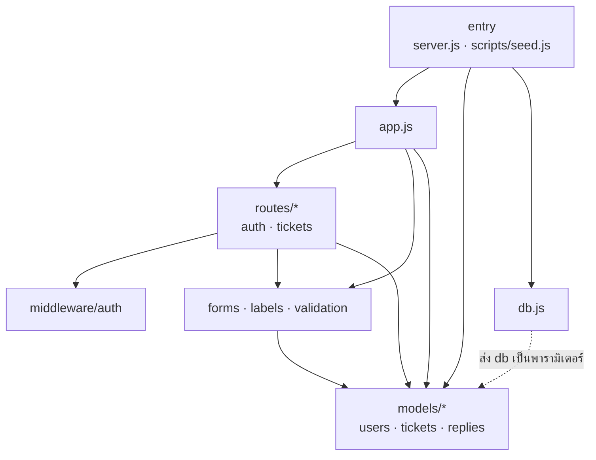

# Customer Support System

ระบบรับเรื่องและติดตามปัญหาลูกค้า (ticket) แบบง่าย ทำขึ้นเพื่อฝึกใช้ AI ช่วยพัฒนาระบบตั้งแต่ออกแบบจนถึงเขียนโค้ด

## ฟีเจอร์

- **ลูกค้า:** สมัครสมาชิก, เข้าสู่ระบบ, สร้าง ticket, ตอบกลับ และติดตามสถานะ ticket ของตัวเอง
- **เจ้าหน้าที่:** ดู ticket ทั้งหมด, กรองตามสถานะ, ตอบกลับ และเปลี่ยนสถานะ (เปิด → กำลังดำเนินการ → ปิดแล้ว)
- เมื่อเจ้าหน้าที่ตอบ ticket ที่ยังเปิดอยู่ สถานะจะเปลี่ยนเป็น "กำลังดำเนินการ" อัตโนมัติ

## เทคโนโลยี

Node.js 22 · Express 4 · EJS · SQLite (better-sqlite3) · bcrypt · express-session · node:test + supertest

## วิธีติดตั้งและรัน

```bash
npm install
npm run seed     # สร้างบัญชีตัวอย่าง
npm start        # เปิด http://localhost:3000
```

### บัญชีตัวอย่าง

| บทบาท | อีเมล | รหัสผ่าน |
|---|---|---|
| เจ้าหน้าที่ | agent@example.com | password123 |
| ลูกค้า | customer@example.com | password123 |

### ตัวแปรสภาพแวดล้อม

| ชื่อ | ค่าเริ่มต้น | ความหมาย |
|---|---|---|
| `PORT` | `3000` | พอร์ตของเว็บ |
| `DB_PATH` | `data/support.db` | ไฟล์ฐานข้อมูล SQLite |
| `SESSION_SECRET` | ค่าสำหรับทดสอบ | secret สำหรับเซ็น cookie ควรตั้งค่าใหม่เสมอ |

## รันเทสต์

```bash
npm test                  # ทั้งหมด
npm run test:unit         # unit test: ทดสอบแต่ละฟังก์ชันแยกกัน ไม่ต้องเปิดเซิร์ฟเวอร์
npm run test:integration  # integration test: ยิง HTTP เข้าแอปจริงผ่าน supertest
npm run test:coverage     # รันทั้งหมดพร้อมรายงาน code coverage
```

| โฟลเดอร์ | ทดสอบอะไร |
|---|---|
| `tests/unit/validation.test.js` | กฎตรวจฟอร์มสมัครสมาชิกและ ticket |
| `tests/unit/middleware-auth.test.js` | การกันสิทธิ์ (login / บทบาท) ด้วย req/res จำลอง |
| `tests/unit/forms.test.js`, `labels.test.js` | ตัวช่วยอ่านค่าฟอร์ม, ป้ายภาษาไทย และการแปลงเวลาเป็นเวลาไทย |
| `tests/unit/models/*.test.js` | users, tickets, replies บนฐานข้อมูล `:memory:` |
| `tests/unit/seed.test.js` | ข้อมูลตัวอย่างรันซ้ำได้โดยไม่ซ้ำ |
| `tests/integration/*.test.js` | flow ผ่านหน้าเว็บ: สมัคร, login, ticket, ตอบกลับ, สิทธิ์ |

## โครงสร้างโปรเจกต์

```
src/
  app.js          สร้าง Express app
  server.js       จุดเริ่มรันเซิร์ฟเวอร์
  db.js           เชื่อมต่อฐานข้อมูลและสร้างตาราง
  models/         ฟังก์ชันอ่าน/เขียนข้อมูล users, tickets, replies
  routes/         หน้าเว็บและฟอร์ม
  views/          template EJS
scripts/seed.js   ข้อมูลตัวอย่าง
tests/unit/       unit test
tests/integration/ integration test
docs/superpowers/ spec และแผนการพัฒนา
```

## Package dependency

ลูกศรคือ `require()` ระหว่างไฟล์ใน `src/` และ `scripts/` (ไม่รวม `tests/`, view และ npm package) ส่วนเส้นประคือค่าที่ส่งให้ตอนรัน ไม่ได้ import



- มีเพียง entry ที่ import `db.js` ส่วน models รับ `db` เป็นพารามิเตอร์ เทสต์จึงใช้ฐานข้อมูล `:memory:` แทนได้
- routes เข้าถึงข้อมูลผ่าน models เท่านั้น และไม่มี import วนกัน
- `validation.js` import เฉพาะรายการค่าที่อนุญาต (`CATEGORIES`, `PRIORITIES`) จาก `models/tickets`

## สิ่งที่ยังไม่ได้ทำ (ต่อยอดได้)

- CSRF token สำหรับฟอร์ม
- แนบไฟล์ / รูปภาพ
- แจ้งเตือนทางอีเมล
- แชทแบบ real-time
- บทบาท Admin และการมอบหมาย ticket
- แบ่งหน้ารายการ ticket
- เก็บ session ในฐานข้อมูล (ตอนนี้ใช้ MemoryStore ทำให้ต้อง login ใหม่ทุกครั้งที่รีสตาร์ทเซิร์ฟเวอร์)
- deploy ขึ้นเซิร์ฟเวอร์จริง
